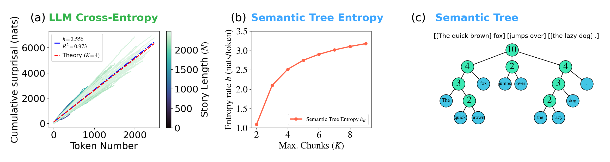
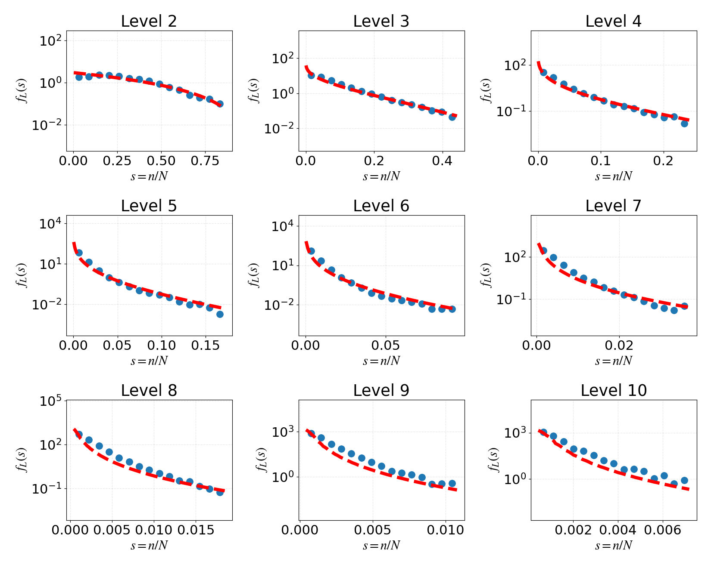
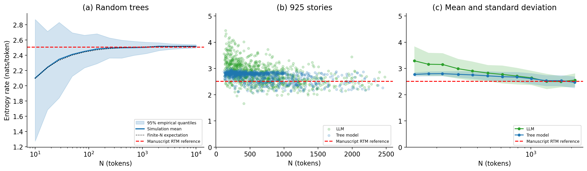
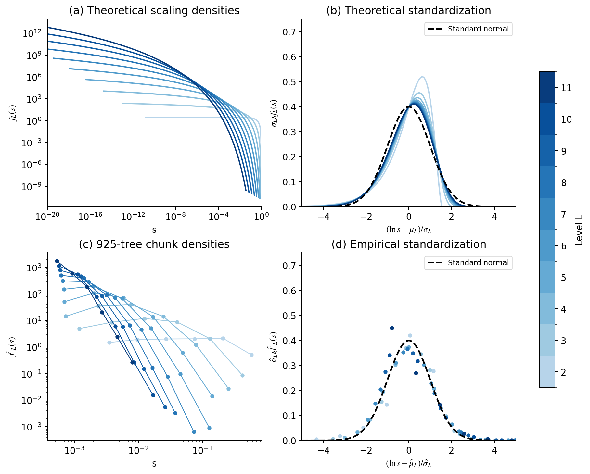

# Semantic Chunking and the Entropy of Natural Language

Code, **925 semantic trees**, cached LLM surprisal, and figure-generation scripts
for *Semantic Chunking and the Entropy of Natural Language* by Weishun Zhong,
Doron Sivan, Tankut Can, Mikhail Katkov, and Misha Tsodyks.

The offline workflow regenerates the figures shown below from the data in this
repository. **No model API, GPU, private repository, external data directory, or
tokenizer download is needed.** The original
`hierarchical_chunker_utilities_LlamaDS_25Nov2025.py` is included separately for
generating new trees with an LLM endpoint.

## Quick start

Use **Python 3.11**. From a fresh checkout:

```bash
git clone https://github.com/zhongweishun/semantic_chunking_entropy.git
cd semantic_chunking_entropy
python -m venv .venv
```

Activate the environment with `source .venv/bin/activate` on Linux/macOS, or
`.venv\Scripts\Activate.ps1` in Windows PowerShell. Then:

```bash
python -m pip install -r requirements.txt
python -m unittest discover -s tests -v
python validate.py
python reproduce.py
python validate.py --results
```

`reproduce.py` writes PNG and vector PDF figures to `figures/` and numerical
tables to `results/`. Run all commands from the checkout root. Dependencies
are pinned to the tested versions. Data are read directly from the archives;
ordinary Git is sufficient, with no Git LFS or separate download step.
[`requirements-lock.txt`](requirements-lock.txt) records the full dependency
snapshot, including transitive packages, from the clean Python 3.11 install.

To rebuild one figure or write outputs elsewhere:

```bash
python reproduce.py --figure 2
python reproduce.py --figure 1 3 5 --out-dir figures --results-dir results
```

## Figures and reproduction commands

These are regenerated scientific plots with portable layouts. Panel letters
refer to the main manuscript. Stochastic model panels are regenerated with an
explicit seed; the empirical panels use the bundled, fixed observations.

| Main-text panels | Plotting file | Inputs and numerical output | Command |
|---|---|---|---|
| Figure 1a | [`analysis/figure1.py`](analysis/figure1.py) | 1,000-story cumulative-surprisal cache; pooled fit in `results/figure1.json` | `python reproduce.py --figure 1` |
| Figure 1b | [`analysis/rtm.py`](analysis/rtm.py), [`analysis/figure1.py`](analysis/figure1.py) | RTM entropy recurrence at `N=5000`, `K=2,...,9` | Same command |
| Figure 1c | [`analysis/figure1.py`](analysis/figure1.py) | Fixed illustrative tree for “The quick brown fox jumps over the lazy dog.” | Same command |
| Figure 2b | [`analysis/figure2.py`](analysis/figure2.py) | 925 trees, saved histogram windows, `K=4` theory at `N=2500`; `results/figure2b.json` | `python reproduce.py --figure 2` |
| Figure 3a | [`analysis/rtm.py`](analysis/rtm.py), [`analysis/figure3.py`](analysis/figure3.py) | Seeded stars-and-bars simulations; `results/rtm_simulation.npz` | `python reproduce.py --figure 3` |
| Figure 3b–c | [`analysis/figure3.py`](analysis/figure3.py) | Paired 925-tree/surprisal cohort; per-story CSV and binned statistics | Same command |
| Figure 5a–b | [`analysis/rtm.py`](analysis/rtm.py), [`analysis/figure5.py`](analysis/figure5.py) | Beta-product density and its lognormal standardization | `python reproduce.py --figure 5` |
| Figure 5c–d | [`analysis/figure5.py`](analysis/figure5.py) | Chunk-size distributions and standardization of the bundled 925 trees | Same command |

### Cumulative surprisal and tree entropy



Panel (a) uses all **1,000 cached surprisal traces** in
`data/llm_entropy_reddit1000.json.gz`. Ordinary least squares over all available
`(token index, cumulative surprisal)` pairs gives **slope 2.546096 nats/token**
and **R² = 0.971774**. Token indices start at zero, matching the source analysis.
This pooled fit is a different statistic from the mean of the per-story slopes
used in Figure 3. Long stories contribute more observations to the pooled fit.

Panel (b) computes `H(N)/N` at `N=5000` using the exact finite-size recurrence
described in [Methods](docs/METHODS.md). The plotted quantity is a finite-size
approximation to the asymptotic rate. Panel (c) is a fixed schematic: its tokens
and branching structure are specified explicitly in the plotting code.

### Pooled chunk-size distributions



Each node size `n` is divided by its tree's root mass `N`. Samples are pooled by
level, with root at level 1, and each tree's deepest level excluded. The 15-bin
histograms use the saved per-level windows. The red curves are the supplied
finite-`N` RTM distributions at `N=2500`, `K=4`.

The average **KL(data || theory) over levels 2–9 is approximately 0.0501**.
`results/figure2b.json` records every window, bin edge, sample count, empirical
density and per-level KL, so the plotted statistics can be reused directly.

### Entropy-rate typicality



Panel (a) generates **128 realizations per length** on 14 logarithmically spaced
lengths from 10 to 10,000 tokens, using Python's `random.Random(20260928)`.
It shows the mean and empirical 2.5%–97.5% quantiles, together with the exact
finite-size expectation. The original plotting scripts' reference value
**2.507174205174 nats/token** is retained as the dashed line in the panels.

For panels (b) and (c), each LLM rate is the regression slope of one story's
cumulative surprisal. Each tree rate is its negative RTM log score divided by
its partition mass. The paired cohort has 925 records:

| Statistic | Reference value |
|---|---:|
| LLM rate, mean ± population SD | 2.820 ± 0.405 nats/token |
| Tree rate, mean ± population SD | 2.692 ± 0.192 nats/token |
| Pearson correlation of the two rates | 0.270 |

Panel (c) uses 12 equal-width bins in log length, requires at least five points
per bin, and shows the mean ± one population standard deviation. Each entropy
measure uses its own token-length axis. Exact per-story values are in
[`results/entropy_rates_925.csv`](results/entropy_rates_925.csv).

The model simulations can be varied explicitly:

```bash
python reproduce.py --figure 3 --seed 24 --simulation-replicates 256
```

### Scaling across levels



The theoretical curve at level `L` is the density of a product of `L-1`
independent `Beta(1,K-1)` variables, with `K=4`. FFT convolution in `-ln(s)`
computes the density on a fixed 65,536-point grid spanning `s=1e-20` to `1`.
The standardization uses the exact log moments of the Beta product.

Empirical panels use the same **925-tree cohort** as Figure 2b. At each level,
positive size fractions are histogrammed in log space, and the mean and
population SD of `ln(s)` define the standardized variable. Six bins per level
follow the within-corpus plotting convention in the source notebook. The
standard normal is a comparison curve, not a fitted curve. Full numerical
settings and level counts are saved in `results/figure5abcd.json`.

## Files and datasets

| File or directory | Purpose |
|---|---|
| [`reproduce.py`](reproduce.py) | Entry point for all four displayed figure files |
| [`analysis/common.py`](analysis/common.py) | Archive reader, tree-size traversal, level pooling, entropy scores and binning |
| [`analysis/rtm.py`](analysis/rtm.py) | Entropy recurrence, weak-composition simulation, Beta-product density |
| [`analysis/figure1.py`](analysis/figure1.py), [`figure2.py`](analysis/figure2.py), [`figure3.py`](analysis/figure3.py), [`figure5.py`](analysis/figure5.py) | Figure-specific input selection and plotting |
| [`data/trees_cut30.tar.gz`](data/trees_cut30.tar.gz) | **925 original complete result JSONs**, byte-preserved from the correlations repository |
| [`data/tree_manifest.json`](data/tree_manifest.json) | Every story ID, archive member, SHA-256, saved-token count, partition mass and leaf counts |
| [`data/source_manifest_925.json`](data/source_manifest_925.json) | Original source-run metadata for the 925 trees |
| [`data/llm_entropy_reddit925.json.gz`](data/llm_entropy_reddit925.json.gz) | Cumulative surprisal arrays matched to the 925 tree IDs |
| [`data/llm_entropy_reddit1000.json.gz`](data/llm_entropy_reddit1000.json.gz) | Full 1,000-story cumulative-surprisal cache used by Figure 1a |
| [`data/windows_nb100.json`](data/windows_nb100.json) | Fixed per-level histogram windows used for Figure 2b |
| [`data/provenance.json`](data/provenance.json) | Source repositories, commits and hashes of copied inputs |
| [`theory/theory_dist_k=4.json`](theory/theory_dist_k=4.json) | Saved finite-`N` RTM distributions |
| [`src/recompute_theory.py`](src/recompute_theory.py) | Recompute the saved theory from the Markov formulation |
| [`src/rtm_theory_utilities.py`](src/rtm_theory_utilities.py) | Original scalar/reference RTM utilities |
| [`src/hierarchical_chunker_utilities_LlamaDS_25Nov2025.py`](src/hierarchical_chunker_utilities_LlamaDS_25Nov2025.py) | Preserved November 25, 2025 semantic chunker |
| [`chunk_text.py`](chunk_text.py) | Small command-line wrapper for the Nov25 chunker |
| [`validate.py`](validate.py), [`tests/test_analysis.py`](tests/test_analysis.py) | Dataset integrity and numerical correctness checks |
| [`requirements.txt`](requirements.txt), [`requirements-lock.txt`](requirements-lock.txt), [`requirements-chunker.txt`](requirements-chunker.txt) | Offline analysis dependencies, complete tested environment, and optional model dependencies |
| [`figures/`](figures/), [`results/`](results/) | Rebuilt PNG/PDF figures and numerical outputs |
| [`docs/METHODS.md`](docs/METHODS.md) | Equations, stopping conventions, normalization and numerical validation |

### Read the 925 trees

```python
from analysis.common import iter_trees, sizes_by_level

for story_id, result in iter_trees():
    partition = result["partition"]
    levels = sizes_by_level(partition)
    # result also retains original_text, tokens, hierarchy and span_tree.
```

Archive members are named `k=4/{story_id}_result.json`. Integer leaves store
token counts; nested lists store internal nodes. These saved semantic trees can
contain multi-token terminal leaves. They are the original **925-tree analysis
cohort**, with **618,417 tokens of partition mass**. No completion or new
chunking is applied during figure reproduction.

One retained record, story `100426`, has partition mass 1,102 and 1,426 saved
tokens. The original partition is preserved, and tree-based normalization uses
1,102. The matching LLM cache uses its own sequence length; scoring text and
tree text are not assumed to be byte-identical. These conventions are checked
and recorded by `validate.py`.

The 925-score cache is an exact subset of the 1,000-score cache: all 925 IDs and
their entire arrays match. The full cache contains **scores**, not an additional
archive of semantic trees. The manuscript identifies the scoring model as
Llama-3.3-70B; the cached records themselves contain only cumulative information
arrays. The semantic trees were generated with Llama-4-Maverick and `K=4`.

### Recompute the finite-N theory

The default figures use the bundled theory cache. To regenerate it from the
Markov transition matrices on a machine with sufficient memory:

```bash
python src/recompute_theory.py --k 4 --N 2500 --lmin 2 --lmax 11 --out theory/regenerated_k4.json
```

The implementation forms dense matrices; `N=2500` needs several hundred MB of
working memory. Small-`N` comparison against the original reference utilities
is included in the numerical checks. The entropy recurrence used by Figures
1b and 3a is separate and uses only linear memory.
The full `N=2500`, `K=4`, level 2–11 cache was also regenerated and matched the
supplied final-length distributions exactly in the reference environment.

## Generate new trees with the Nov25 chunker

The original Nov25 source is included byte-for-byte from the curated source
repository. Its executable chunking logic is not replaced by the newer
chunker in `semantic-chunking`. Model execution is optional and separate from
offline figure reproduction.

```bash
python -m pip install -r requirements-chunker.txt
python chunk_text.py story.txt --output generated_trees/story_result.json --base-url http://localhost:8000/v1
```

Use your own OpenAI-compatible endpoint serving
`meta-llama/Llama-4-Maverick-17B-128E-Instruct-FP8`. Set `OPENAI_API_KEY` in your
environment if the endpoint requires authentication; `OPENAI_BASE_URL` can be
used instead of `--base-url`. The Nov25 tokenizer adapter uses the
`meta-llama/Llama-3.1-70B-Instruct` tokenizer for Llama models, so generating new
trees requires access to that tokenizer as well as the model endpoint.

`K=4` and fallback disabled are the wrapper defaults. Add `--enable-fallback`
to permit the original chunker's fallback splitting, or `--multithread` to
enable concurrent requests. The saved result JSON retains the original format.
New calls are stochastic and produce new trees; use the bundled archive for
reproducing the published cohort. `python chunk_text.py --help` does not import
the optional model dependencies.

## Provenance and citation

The 925-tree archive, paired scores, histogram windows, finite-`N` theory and
Nov25 code are extracted from `zhongweishun/semantic_chunking_correlations`,
commit `ca5cbeccba06fd800ef4040c9c95858a79f0fed3`. Their original project is
`zhongweishun/semantic-chunking`. Local manuscript analysis notebooks supply
the level-standardization and plotting conventions. All required code and
data are included here; source repositories are provenance references only.
See [`data/provenance.json`](data/provenance.json) for the precise versions.

The story IDs refer to the training split of the **WritingPrompts** corpus
introduced by Angela Fan, Mike Lewis and Yann Dauphin, *Hierarchical Neural
Story Generation* (2018). Story text is retained as scientific input with its
original provenance; this repository does not relicense the underlying corpus
or model artifacts. See [`CITATION.cff`](CITATION.cff) for manuscript citation
metadata.
